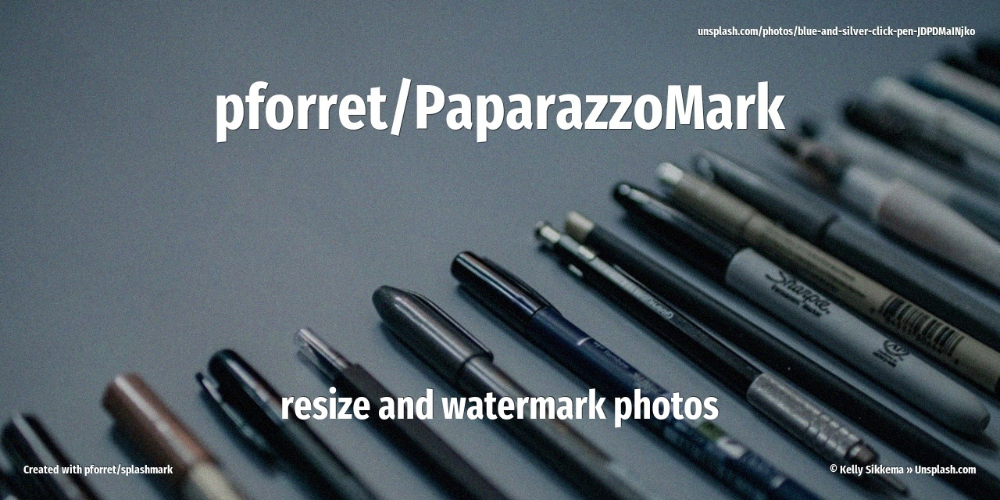

# PaparazzoMark



**Professional photo watermarking tool for photographers**

PaparazzoMark is a powerful PHP-based command-line tool that adds photographer watermarks, copyright text, and logos to your photos. Perfect for batch processing wedding photos, event photography, or any collection that needs professional branding.

## Key Features

- **Batch Processing**: Process hundreds of photos with a single command
- **Text Overlays**: Add copyright text, photographer credits, event names with custom fonts and effects
- **Image Overlays**: Add logo watermarks, venue branding, or sponsor images
- **Text Effects**: Shadow, outline, or plain text styles
- **EXIF Metadata**: Automatically embed photographer info, copyright, and event details
- **Smart Resizing**: Automatic aspect ratio preservation while resizing
- **Performance**: Track processing speed (pics/sec, MB/sec)
- **Cross-Platform**: Works on macOS, Linux, and Windows

## Quick Start

### Installation

```bash
# Clone the repository
git clone https://github.com/pforret/PaparazzoMark.git
cd PaparazzoMark

# Install dependencies
composer install
```

### Basic Usage

```bash
# Create a config file
php run.php config:create

# Edit pmark.ini to customize your watermarks

# Process your photos
php run.php export:photos
```

## What It Does

1. **Reads** your configuration (text overlays, logos, metadata)
2. **Finds** all images in the current directory
3. **Processes** each image:
   - Resizes to your target dimensions
   - Applies text watermarks with effects
   - Adds logo overlays
   - Embeds EXIF metadata
4. **Saves** watermarked images to output directory
5. **Reports** performance statistics

## Example Output

```
PaparazzoMark - Photo Watermarking
Config: ...Bologna/2025-10-31-AmarcordEve1/pmark.ini
Output: 2025-10-31-AmarcordEve1.TP
Images: 150 | Overlays: 2

[Progress bar: 150/150]
Done! Processed: 150 | Skipped: 0 | Time: 32.5s | Speed: 4.6 pics/s, 18.2 MB/s
```

## Use Cases

- **Event Photography**: Weddings, concerts, festivals
- **Professional Portfolios**: Add branding to sample images
- **Social Media**: Watermark photos before sharing
- **Stock Photography**: Protect images with copyright text
- **Marketing**: Add venue/sponsor logos to event photos

## Requirements

- **PHP**: 8.2 or higher
- **ImageMagick**: For image processing
- **Composer**: For dependency management

## Documentation

- [Installation Guide](installation.md) - Detailed setup instructions
- [Usage Guide](usage.md) - All available commands
- [Configuration Reference](configuration.md) - Complete config options
- [Examples](examples/index.md) - Sample configurations

## Credits

Created by **Peter Forret** / [TangoPaparazzo.com](https://tangopaparazzo.com)

Professional tango event photography since 2008.

## License

MIT License - See LICENSE file for details

